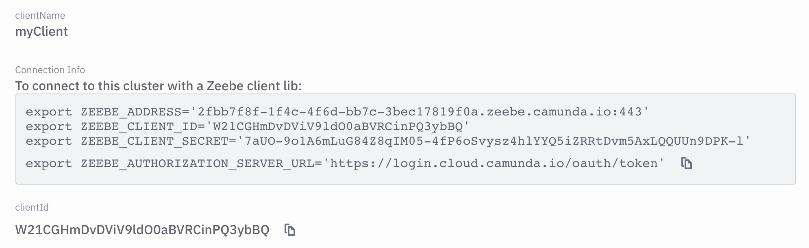
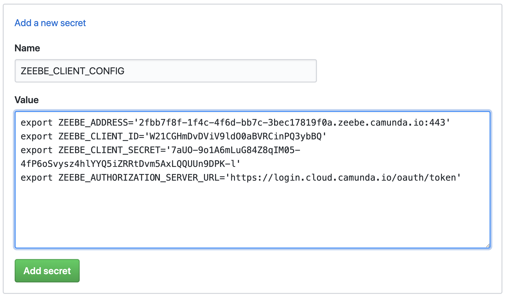

# Integrate GitHub Actions with Zeebe on Camunda Cloud

This GitHub Action allows you to integrate GitHub Actions into workflows orchestrated by [Zeebe](https://zeebe.io) on [Camunda Cloud](https://camunda.io).

You can deploy a workflow definition to Camunda Cloud, create a Camunda Cloud workflow instance from a GitHub Action, start and run an entire workflow on Camunda Cloud and act on the outcome in a GitHub Action, or publish a message from a GitHub Action to a workflow instance running in Camunda Cloud.

See this article: "[Complex multi-repo builds with GitHub Actions and Camunda Cloud](https://zeebe.io/blog/2020/02/camunda-cloud-github-actions/)" for some ideas on orchestrating multi-repo build workflows using Camunda Cloud.

_Note that at the moment it only works in the Ubuntu runner._

## Configure Camunda Cloud credentials

In a repository where you have a GitHub workflow that uses this action, you need to configure your Camunda Cloud client credentials.

* In the [Camunda Cloud console](https://console.cloud.camunda.io/), click the button to copy your client connection info.



* Set a secret in your repo (Repo Settings > Secrets) `ZEEBE_CLIENT_CONFIG`, and paste in the entire block from Camunda Cloud.



See the note at the end of this document if you get errors about missing required configuration keys.

## Deploy a Workflow

Here is an example of deploying a workflow from GitHub. This will deploy the process in the file `bpmn/demo-get-time.bpmn` in the repo:

```
name: Run Get Time Demo

on: [repository_dispatch]

jobs:
  demo-get-time:
    if: github.event.action == 'get_time'
    runs-on: ubuntu-latest

steps:
  - uses: actions/checkout@v2
  - name: Deploy Demo Workflow "Get Time"
    uses: jwulf/zeebe-action@master
    with:
      client_config: ${{ secrets.ZEEBE_CLIENT_CONFIG }}
      operation: deployWorkflow
      bpmn_filename: bpmn/demo-get-time.bpmn
```

## Automate Deployment of BPMN Models on Push to master

Here is a workflow that redeploys changed models in the `bpmn` directory of your repo on a push to the master branch:

```
name: Deploy Workflows

on:
  push:
    branches:
      - master
    paths:
      - 'bpmn/*'

jobs:
  deploy-workflows:
    runs-on: ubuntu-latest

    steps:
      - uses: actions/checkout@v2
      - name: Deploy Updated Workflows
        uses: jwulf/zeebe-action@master
        with:
          client_config: ${{ secrets.ZEEBE_CLIENT_CONFIG }}
          operation: deployWorkflow
          bpmn_directory: bpmn
```

## Start a Workflow

Here is an example of starting a workflow from within a GitHub Action:

```
name: Report Outcome

on: repository_dispatch

jobs:
  report:
    runs-on: ubuntu-latest
    timeout-minutes: 10
    steps:
      - uses: actions/checkout@v2
      - name: Use Node.js 12.x
        uses: actions/setup-node@v1
        with:
          node-version: 12.x
      - run: echo github.event.action: ${{ github.event.action }}
      - name: Create Zeebe Workflow
        uses: jwulf/zeebe-action@master
        with:
          client_config: ${{ secrets.ZEEBE_CLIENT_CONFIG }}
          operation: createWorkflowInstance
          bpmn_process_id: throw-test
          variables: '{"event": "${{ github.event.action }}" }'
```

## Awaiting the outcome of a Workflow

You can create a workflow instance and retrieve the outcome of the workflow for use in further steps:

```
name: Run Get Time Demo

on: [repository_dispatch]

jobs:
  demo-get-time:
    if: github.event.action == 'get_time'
    runs-on: ubuntu-latest

steps:
  - uses: actions/checkout@v2
  - name: Deploy Demo Workflow "Get Time"
    uses: jwulf/zeebe-action@master
    with:
      client_config: ${{ secrets.ZEEBE_CLIENT_CONFIG }}
      operation: deployWorkflow
      bpmn_filename: bpmn/demo-get-time.bpmn
  - name: Execute Demo Workflow "Get Time"
    uses: jwulf/zeebe-action@master
    id: get-time
    with:
      operation: createWorkflowInstanceWithResult
      bpmn_process_id: demo-get-time
  - name: Print Workflow Outcome
    run: echo The outcome is ${{ toJSON(steps.get-time.outputs.result }}
  - name: Print time
    run: echo The time is ${{ steps.get-time.outputs.result.body.time }}
```

When awaiting a workflow outcome, if no `request_timeout` is provided, it defaults to the Gateway timeout of the cluster (15 seconds). For workflows that take longer than this to complete, you should specify a `request_timeout`.

Note that once the connection configuration is provided, it is available to any further Zeebe Action operations in the GitHub workflow.

## Publish a message

Here is an example of publishing a message back to Camunda Cloud, to be correlated with a running workflow. In this example, the action has been started with a `repository_dispatch` event from the CAMUNDA-HTTP worker. The `client_payload` on the event contains the correlationKey value for the message:

```
triggerDependentFlow:
  runs-on: ubuntu-latest
  steps:
    - name: Tell Camunda Cloud What's up!
      uses: jwulf/zeebe-action@master
      with:
        client_config: ${{ secrets.ZEEBE_CLIENT_CONFIG }}
        operation: publishMessage
        message_name: BASE_IMAGE_REBUILT
        correlationKey: ${{ github.event.client_payload.buildid }}
```

Variables can be provided in a `publishMessage` operation. They should be stringified JSON, just like the `createWorkflowInstance` operation.

## Development

Run the `npm run rebuild` task before checking the code in.

The action is rebuilt on GitHub by the build.yaml workflow, to ensure that it has the correct binaries for gRPC in the GitHub runner environment.

## A note on configuration

Previously, you had to create individual secrets for each of the client credential fields: `ZEEBE_ADDRESS`, `ZEEBE_CLIENT_ID`, etc...

However, this is clunky. Ain't nobody got time fo' that!

We are waiting on the [single JSON-parseable connection string](https://github.com/zeebe-io/zeebe/issues/3544) to land. In the meantime, the Zeebe Action parses the text of the credentials block from the Cloud console to extract the credential values. Text parsing is brittle, and a change in the formatting of that block could break it.

As a backup, the previous method still works. To use it that way, create a secret for each one, and paste in the _unquoted_ value of the variable.

Then in your workflows, you need to do:

```
jobs:
  startWorkflow:
    runs-on: ubuntu-latest
    steps:
      - name: Get current time
        uses: gerred/actions/current-time@master
        id: current-time
      - name: Create Zeebe Workflow
        uses: jwulf/zeebe-action@master
        with:
          zeebe_address: ${{ secrets.ZEEBE_ADDRESS }}
          zeebe_client_id: ${{ secrets.ZEEBE_CLIENT_ID }}
          zeebe_authorization_server_url: ${{ secrets.ZEEBE_AUTHORIZATION_SERVER_URL }}
          zeebe_client_secret: ${{ secrets.ZEEBE_CLIENT_SECRET }}
          operation: createWorkflowInstance
          bpmn_process_id: magikcraft-github-build
          variables: '{"buildid": "${{ github.sha }}-${{ steps.current-time.outputs.time }}"}'
```

